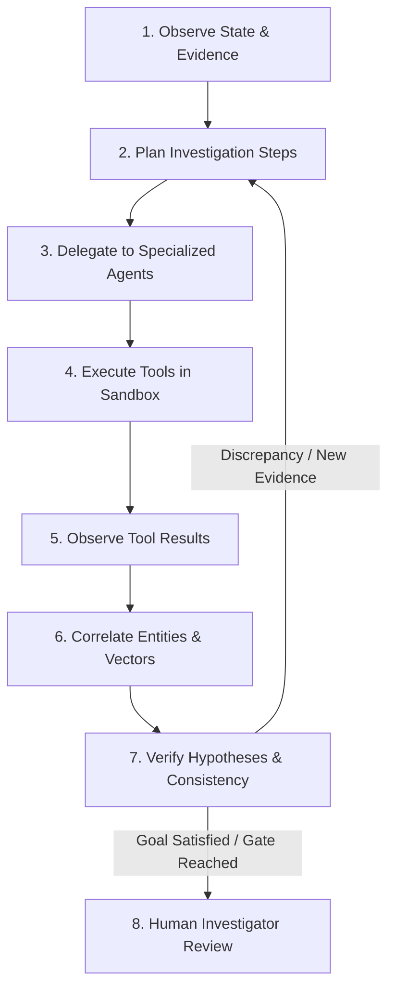
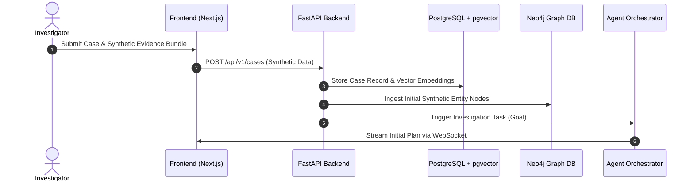
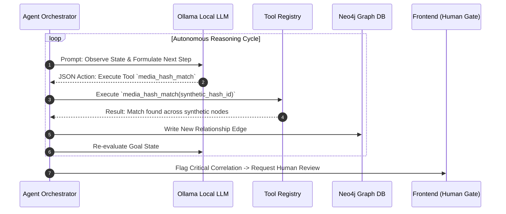

# ACPIA Architecture Documentation

## System Overview & Mission

**ACPIA (Agentic Child Protection Investigation Assistant)** is an advanced, investigation-support prototype built specifically for authorized investigators. ACPIA empowers investigators by orchestrating autonomous AI agents that analyze complex synthetic evidence networks, correlate entities across multi-modal channels, and surface actionable investigation timelines while keeping humans firmly in control.

> [!CAUTION]
> **SYNTHETIC EVIDENCE MANDATE**
> ACPIA is strictly designed and tested using **ONLY synthetic and fictional test data**. Real-world sensitive or actual child-protection evidence MUST NEVER be imported, stored, or processed within this prototype environment.

---

## Core Product Philosophy: Genuinely Agentic (Not a Chatbot)

Traditional chatbot interfaces rely on synchronous text exchanges ("prompts" and "replies") which fail to capture the multi-dimensional, iterative nature of complex digital investigations. ACPIA is built on a **genuinely agentic paradigm**.

Investigators do not "chat" with ACPIA. Instead, investigators assign high-level investigation hypotheses or analytical goals. ACPIA's agent core autonomously drives an iterative **8-Stage Autonomous Control Loop**:



### The 8-Stage Autonomous Loop Explained

1. **Observe**: Ingest synthetic case context, existing entity graphs, file metadata, and previous execution state.
2. **Plan**: Formulate structured, step-by-step investigation plans using local LLM reasoning (via Ollama).
3. **Delegate**: Assign distinct sub-tasks (e.g., media hash correlation, pseudonym link analysis, text embedding comparison) to specialized sub-agents.
4. **Execute Tools**: Sub-agents invoke registered, sandboxed deterministic tools (hash matching, OCR, graph queries, vector distance metrics).
5. **Observe Results**: Parse tool execution outputs, logs, and metadata into structured observations.
6. **Correlate**: Cross-reference newly derived synthetic entities in Neo4j (graph relations) and PostgreSQL/pgvector (semantic embeddings).
7. **Verify & Re-Plan**: Test whether hypotheses hold. If contradictory signals emerge or missing links are flagged, automatically update the plan and loop back to execution.
8. **Human Review**: Present clear, non-conversational visual dashboards (Execution Tree, Entity Correlation Matrix, Audit Log) for human sign-off before finalizing investigative conclusions.

---

## Component Architecture & System Boundaries

```mermaid
graph TB
    subgraph UI ["Frontend Layer (Next.js 14 / Tailwind CSS)"]
        Dash[Investigation Dashboard]
        Tree[Agent Execution Tree UI]
        GraphUI[Neo4j Graph Visualization]
        ReviewUI[Human Gate Approval Portal]
    end

    subgraph Backend ["Backend Gateway & Agent Core (Python FastAPI)"]
        API[FastAPI Gateway Services]
        Orch[Agent Planner & Controller Engine]
        Registry[Tool Registry & Sandbox Exec]
    end

    subgraph Orchestration ["Orchestration & Workflow"]
        N8N[Self-Hosted n8n Docker Engine]
    end

    subgraph LocalAI ["Local AI Engine"]
        Ollama[Ollama LLM (Llama3 / Mistral)]
    end

    subgraph Persistence ["Data & Persistence Layer"]
        PG[(PostgreSQL 16 + pgvector)]
        Neo[(Neo4j 5 Community Edition)]
    end

    UI <-->|REST API / WebSockets| API
    API <-->|Local Inference API| Ollama
    API <-->|State & Embeddings| PG
    API <-->|Entity Relationship Graph| Neo
    API <-->|Trigger Async Workflows| N8N
    N8N <-->|Webhook Events| API
    Orch <-->|Invoke Sandboxed Tools| Registry
```

### Detailed Component Responsibilities

#### 1. Frontend (`frontend/`)
- **Tech Stack**: Next.js 14 (App Router), React, TypeScript, Tailwind CSS.
- **Responsibilities**:
  - Displays real-time agent execution trees, action logs, and tool invocation status.
  - Interactive graph visualization of synthetic entities and relationship edges (integrating Neo4j graph data).
  - Multi-modal evidence visualizer (synthetic media hashes, timeline correlation).
  - **Human-in-the-Loop Gate Portal**: Interactive confirmation prompts for investigators to approve or redirect agent execution paths.

#### 2. Backend Gateway (`backend/`)
- **Tech Stack**: Python 3.11, FastAPI, Pydantic v2, AsyncPG, Neo4j Async Driver.
- **Responsibilities**:
  - REST APIs for case management, evidence uploading, and agent job control.
  - WebSocket engine pushing real-time agent state mutations to the frontend.
  - Security, authorization context, and request validation.

#### 3. Agent Framework (`agents/`)
- **Structure**:
  - `agents/core/`: Planner, Re-planner, State Manager, and Coordinator Loop.
  - `agents/specialized/`: Domain-specific agents:
    - *Media Analysis Agent*: Processes synthetic image/video metadata and perceptual hashes.
    - *Text & Vector Agent*: Extracts synthetic entities and generates vector embeddings.
    - *Graph Correlation Agent*: Identifies multi-hop link relationships across synthetic online profiles.
- **Responsibilities**: Implements the autonomous Observe-Plan-Delegate-Execute loop independently of the web server thread.

#### 4. Tool Registry (`tools/`)
- **Structure**: `tools/media/`, `tools/text/`, `tools/network/`.
- **Responsibilities**: Strictly typed, deterministic Python tools invoked exclusively by agents. Tools possess defined schemas, safety constraints, and logging interfaces.

#### 5. Workflow Orchestration (`n8n/`)
- **Tech Stack**: Self-hosted n8n running in Docker.
- **Responsibilities**: Manages asynchronous, event-driven long-running workflows, scheduled synthetic data ingest tasks, and external notification hooks.

#### 6. Local AI Engine (Ollama)
- **Tech Stack**: Ollama containerized service.
- **Responsibilities**: Provides air-gapped, local LLM inference (e.g. Llama 3 8B, Mistral) for agent task planning, JSON state generation, and reasoning. Ensures no data ever leaves the local network.

#### 7. Databases (`database/`)
- **PostgreSQL 16 + pgvector**:
  - Stores relational case records, evidence metadata, immutable audit trails, and agent execution states.
  - `pgvector` extension stores high-dimensional vector embeddings for synthetic text/media similarity search.
- **Neo4j 5 Community Edition**:
  - Stores synthetic entity nodes (Accounts, Handles, Hashes, IP Hashes, Locations) and relationship edges (`LINKED_TO`, `COMMUNICATED_WITH`, `ASSOCIATED_MEDIA`).

---

## Data Flow & System Interactions

### 1. Case Ingestion & Initial Observation


### 2. Autonomous Agent Execution Loop


---

## Security, Auditability & Human-in-the-Loop

1. **Immutable Audit Trail**: Every agent observation, planning step, tool invocation, tool output, and human approval is logged sequentially with cryptographic timestamps in PostgreSQL.
2. **Explicit Human-in-the-Loop Gates**: The agent orchestrator cannot proceed past critical decision thresholds (e.g., final correlation report export or high-confidence entity linking) without explicit investigator authorization via the UI portal.
3. **Air-Gapped Local Inference**: Ollama guarantees zero outbound telemetry or cloud AI reliance.

---

## Monorepo Directory Map

```
ACPIA/
├── frontend/             # Next.js 14, React, TS, Tailwind CSS UI Dashboard
├── backend/              # Python FastAPI service & REST/WS endpoints
├── agents/               # Autonomous Planner, Sub-Agents, State Control
├── tools/                # Sandboxed Tool Registry (Media, Text, Network)
├── data/
│   └── synthetic/        # Fictional synthetic dataset schemas & test cases
├── database/
│   ├── postgres/         # init.sql with pgvector extension setup
│   └── neo4j/            # init.cypher Cypher constraints & indices
├── n8n/                  # n8n workflow configuration & exported templates
├── docker/               # Container build definitions (Frontend/Backend)
├── docker-compose.yml    # Complete 6-service local deployment stack
├── .env.example          # Environment variables reference
├── .gitignore            # Monorepo git ignore rules
└── README.md             # Repository landing documentation
```
